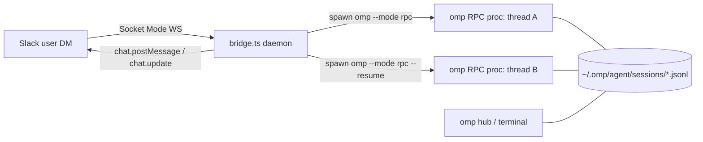
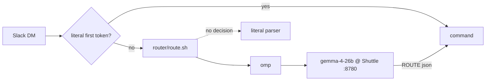

# omp Slack Bridge — Design

Bidirectional Slack ↔ omp integration: dispatch coding tasks from Slack DMs,
interact with running agents (answer `ask` questions, steer), and continue
sessions — modeled on `omp hub` (shared session store, lazy reattach, idle
reaping), but transport is `omp --mode rpc` JSONL over stdio instead of tmux.

## Topology



- One Slack **thread** ↔ one omp **session** (`.jsonl` on disk) ↔ at most one
  live RPC process. Registry persisted at `~/.omp/slack-bridge/state.json`.
- Sessions live in the standard session dir → visible in `omp hub`; terminal
  sessions can be continued from Slack via `resume`, bridge sessions can be
  foregrounded in the hub.
- Idle RPC processes are reaped after `IDLE_TTL_MIN` (hub-style: process dies,
  session file persists); a later thread reply respawns with `--resume`.

## Files (all in `~/.omp/slack-bridge/`)

| File | Owner | Purpose |
|---|---|---|
| `types.ts` | design (done) | All shared contracts. Implementations MUST import from here and MUST NOT redefine. |
| `omp-rpc.ts` | RpcCore | Raw JSONL protocol client over a spawned `omp --mode rpc` process. |
| `slack.ts` | SlackTransport | Socket Mode WS client + minimal Web API wrapper. Zero omp knowledge. |
| `bridge.ts` | BridgeCore | Daemon entry: routing, registry, task lifecycle, ask relay. |
| `blocks.ts` | BridgeCore | Block Kit / mrkdwn rendering helpers. |
| `registry.ts` | BridgeCore | Thread↔session registry with JSON persistence. |
| `router.ts` | Router | `createRouter` — bridge-side client: spawns `router/route.sh`, enforces `routerTimeoutMs`, parses the single JSON line. Fails open (`undefined`). |
| `agent-defs.ts` | Router | `listAgentDefinitions` — the agent inventory offered to the router: frontmatter `name:` + `description:` of `<repo>/.omp/agents/*.md`, then `~/.omp/agent/agents/*.md` (project shadows home). |
| `router/route.sh` | Router | omp harness invocation: message on stdin, one compact `RouterDecision` JSON line on stdout (command + a `trace` of the worker's turn count and three-line self-account), exit 0 = decision. |
| `router/prompts/entry.md` | Router | System prompt for the routing model. |
| `router/tools/commands.ts` | Router | omp extension registering the five commands as tools (plain JSON-Schema parameters, no npm deps); each returns `ROUTE <json>` in its result. |
| `prompts/slack-reply.md` | BridgeCore | Reply guidance appended to every spawned agent's system prompt: attach images, keep the answer in the message, absolute paths. |
| `prompts/slack-repos.md` | BridgeCore | The `REPOS` inventory template (`{{repos}}`), appended to the same system prompt: alias → path for every configured repo, the task's own cwd marked. |
| `omp-rpc.test.ts` | RpcCore | Unit tests against a fake child (`bun test`). |
| `slack.test.ts` | SlackTransport | Unit tests against a local mock WS server (`bun test`). |
| `bridge.test.ts` | BridgeCore | Unit tests for command parsing + registry (`bun test`). |
| `manifest.json`, `.env.example`, `README.md`, `package.json`, `tsconfig.json` | SetupAssets | Slack app manifest, config template, setup + run docs. |

Runtime: **Bun only, zero npm dependencies.** `fetch`, `WebSocket`, `Bun.file`,
`Bun.spawn` cover everything. TypeScript strict.

## omp RPC protocol (pinned; source of truth `~/oh-my-pi-src/docs/rpc.md`)

- Spawn: `$OMP_BIN --mode rpc` (+ `--resume <sessionPath>` to reattach, `--agent <name>` optional — omp applies that agent's model, thinking level, tools and system prompt), `cwd` = task dir, env `OMP_HUB_NEW_SESSION=1` for *new* tasks (agent self-isolates in a git worktree).
- stdout: one JSON object per line. First relevant frame: `{"type":"ready"}` (wait ≤30s).
- Commands (stdin JSONL, correlate on `id`): `prompt` (with `streamingBehavior:"steer"` — always include; ack is immediate, completion signaled by `agent_end` event), `abort`, `get_state`, `get_last_assistant_text`, `set_session_name`, `set_host_tools`.
- Frames to route: `response` (by `id`); events `agent_start`, `agent_end`, `turn_start/end`, `tool_execution_start/update/end`, `message_update`; `extension_ui_request` (methods `select`, `confirm`, `input`, `editor`, `cancel`, `notify`, `setStatus`, `open_url` — others ignored); `host_tool_call` / `host_tool_cancel`; `extension_error`.
- UI responses (stdin): `{type:"extension_ui_response", id, value:string}` (select → chosen **label**, input/editor → text), `{..., confirmed:boolean}`, `{..., cancelled:true}`.
- **Ask questions**: the builtin `ask` tool does NOT register in RPC mode (`AskTool.createIf` requires interactive UI at tool-registry construction — verified empirically: `get_state.dumpTools` lacks `ask`). The bridge therefore registers its own `ask` **host tool** (`set_host_tools`, schema mirroring the builtin: `questions[]` with `id`/`question`/`options{label,description}`/`multi`/`recommended`). Agent calls → `host_tool_call` → bridge renders Slack blocks per question, collects answers (buttons or free-text thread reply), then sends `host_tool_result` with a text summary (`User answers:` lines). `host_tool_cancel` withdraws pending questions. The `extension_ui_request` select/confirm/input relay stays for extensions and login flows.
- **Attaching files**: the bridge also registers an `attach_file` host tool (`paths[]` + optional `comment`). The agent calls it → the bridge reads each path (≤10 files, ≤32MB each), uploads them in one `files.completeUploadExternal` so Slack posts a single message, and answers with a sentence naming what landed and what did not. A bad path is a note in that sentence, never a failed batch; nothing readable is `isError`. This exists because Slack renders an *uploaded* image inline and renders a filesystem path as dead text — it is the only way a screenshot the agent produced reaches the user.
- **Reply guidance**: every spawn passes `--append-system-prompt` with `prompts/slack-reply.md`, plus `prompts/slack-repos.md` rendered from `REPOS` when any alias is configured — one flag, since the CLI's `--append-system-prompt` is last-wins rather than repeatable. It rides the system prompt rather than the first user message so it applies to later steers too, never lands in the transcript as words the user appears to have said, and never pollutes the session name. Content: attach images instead of naming them, keep the answer under `FINAL_INLINE_MAX` or it becomes a `response.md` upload, never answer by pointing at a file, make every path absolute — and the alias vocabulary the user types in Slack, so `look at nomad` resolves to a path instead of a search.

## Slack app (Socket Mode — no public URL)

- Tokens: `SLACK_APP_TOKEN` (`xapp-`, scope `connections:write`) + `SLACK_BOT_TOKEN` (`xoxb-`).
- Bot scopes: `chat:write`, `im:history`, `im:write`, `users:read`, `files:read`, `files:write`. (`files:read` is what makes a DM attachment fetchable; without it Slack answers file downloads with a 200 + HTML sign-in page.)
- Events: `message.im`. Interactivity enabled (block actions arrive over the socket as `interactive` envelopes).
- Envelope handling: every envelope MUST be acked (`{envelope_id}`) immediately; payload processing is async after ack. Reconnect on `disconnect` frames / WS close with backoff; dedup retried event deliveries by `event_id`.

### Delivery is not guaranteed — the bridge closes the gap

Socket Mode has **no backlog**: a DM sent while the app has no live socket is
never delivered, and Slack never retries it. Two failure shapes produce that,
and the second is invisible from inside the process:

1. the bridge is down (crash, restart, laptop asleep);
2. the socket is a **zombie** — a proxy or NAT dropped the TCP connection
   without a FIN, so `readyState` still reads OPEN and nothing ever arrives.

Three mechanisms, in order of who catches what:

- **Client ping every 30s** (`slack.ts`): writing to a dead peer draws the RST
  that fires `close`, which is what starts the reconnect. Catches (2) whenever
  the path is merely dropped rather than black-holed.
- **Catch-up sweep every 2 min and on startup** (`bridge.ts#catchUp`):
  `conversations.history` per allowed-user DM, replaying every top-level
  message that has no thread replies, no task record on its ts, and was not
  already routed this process. Bounded by `CATCHUP_WINDOW_MIN` (default 60) so
  a cold start never replays yesterday, and by a per-channel watermark in
  `state.json` so a restart never replays what a previous sweep took.
- **Stale-socket inference**: finding missed DMs while `connected` is true
  proves the socket is lying, so the sweep forces a reconnect before replaying.

Not covered: **thread replies** missed while down. `conversations.history`
returns only top-level messages, so a steer typed into a task thread during an
outage is lost — retype it.

### Attachments

A DM's `files[]` (upload or `file_share` subtype) are downloaded with the bot
token into `$TMPDIR/omp-slack-attachments/<ts>/` and appended to the prompt as
local paths, so the agent can `read` them. Files hosted outside Slack (Drive,
Box) have no bot-fetchable URL and are listed by name + permalink instead;
unfurled link URLs (`attachments[].from_url`) are passed through as-is. A file
that cannot be fetched is still named in the prompt with the reason — the agent
must never answer as if nothing was attached.

**Images go one step further.** A `png`/`jpeg`/`gif`/`webp` under 8MB is also
base64-decoded into an `ImageContent` block on the `prompt` frame
(`images?: ImageContent[]`, see `docs/rpc.md`), so the model *sees* the
screenshot in the same turn instead of having to guess that a path is worth
opening. Both forms are emitted: the block is what it looks at, the path is what
`inspect_image` and re-reads need. Any other `image/*` — HEIC off a phone, SVG,
TIFF — stays path-only and the note says why; an undecodable block would reach
the provider and fail the whole turn, whereas `read` refuses it cleanly. omp
normalizes and resizes the blocks per model and drops them for a text-only one,
so the bridge never inspects model capability.

**A DM that is nothing but attachments** (a pasted screenshot, no words) starts a
task rather than falling through to help: there is no text to classify, and the
router rejects an empty message anyway. It runs in `DEFAULT_REPO` with a fixed
prompt that asks the agent to describe what it was handed and stop — enough to
bind the thread, after which every reply is an ordinary steer carrying its own
attachments. With no `DEFAULT_REPO` configured there is no repo to start in, so
the bridge answers with the materialized paths instead; a later reply can name
them, since a reply only ever carries its own files.

## UX (DM with the bot)

Top-level DM commands (first token, case-insensitive). Every reply is a **thread
reply on the triggering message** (`thread_ts` = that message's `ts`, or its
existing root when the command was typed inside a thread), so a task's whole
thread hangs under what the user asked for:

| Command | Behavior |
|---|---|
| `run <alias\|path> <prompt…>` | New task: resolve dir (alias from `REPOS` config, else absolute path under `$HOME`), spawn RPC proc, `set_session_name` from prompt, post the task header as the first reply under the user's message — that message's `ts` is the thread id, register thread. The header is posted before the child exists, then edited from the post-handshake `get_state`: session id (parsed out of `<timestamp>_<id>.jsonl`, the id `omp --resume <id>` takes), session path, active model. |
| `orchestrate <alias\|path> <prompt…>` | Same as `run`, except omp is spawned with `--agent orchestrate` (the agent file pins its model and thinking level) and the prompt is prefixed `orchestrate: ` so omp's `orchestrator-identity` skill triggers. With no `orchestrate` definition on disk the prefix still applies and the default worker takes the task. |
| `sessions` | List registry entries (live ⏵ / idle ⏸, dir, name, age) + how to continue (`reply in thread`) . |
| `resume <sessionPath>` | Attach an existing on-disk session (e.g. one started in terminal): spawn `--resume`, post header, register thread. |
| `status` | Bridge status: live procs / registry size / uptime. |
| `help` / anything else top-level | Usage text. Plain top-level text is NOT a task (prevents accidents). |

In-thread messages:

- Pending `input`/`editor` request for that thread → the message text answers it.
- `abort` → RPC `abort`. `kill` → stop proc (session file persists, still resumable). `status` → `get_state` summary.
- Anything else → `prompt` with `streamingBehavior:"steer"` (steers mid-turn, prompts when idle). Proc dead → respawn `--resume` first (lazy reattach).
- Thread the registry doesn't know (a reply under a `sessions` listing or a help message) → handled as a fresh top-level command, so the reply is answered instead of dropped.

Agent → Slack rendering:

- Per turn, one **status message** posted on `agent_start`, then `chat.update`d on a ≥2s throttle: phase line + the last 4 timeline lines. The timeline interleaves thinking excerpts (`💭 …`, one line per thinking block, rewritten in place as it streams) with `tool_execution_start` labels (`⏵ bash`, `⏵ edit src/x.ts`), so a turn that reasons before touching a tool still shows movement. Thinking excerpts come from `message_update` → `assistantMessageEvent` (`thinking_delta`/`thinking_end`); `blocks.ts:thinkingLine` renders the newest complete reasoning-summary headline (gpt-5.x/codex `**Headline**`), else the newest finished sentence, and nothing while the block is still a stub — no token-level streaming (Slack rate limits; deltas add fragility).
- On `agent_end`: fetch `get_last_assistant_text`, replace status message with final text (mrkdwn, 3000-char section chunks; text > 12k chars → `files.uploadV2` snippet attached to thread).
- `extension_ui_request select/confirm` → Block Kit message: question + option descriptions; ≤5 options → buttons, else `static_select`; `action_id` = `ui:<requestId>`, value = option label. Click → `extension_ui_response` + edit the ask message to show the choice (`✅ label — answered by @user`). `cancel` request (`targetId`) → edit ask message to `⌛ cancelled` and drop pending state.
- `notify` → small thread message (info/warn/error prefix). `setStatus`/`open_url` → thread message (URL as link). Everything user-visible passes through `blocks.ts` sanitizers (mrkdwn-escape `&<>`, truncate).

## Front-door router (local model via Shuttle)

A free-form DM ("start a task in omp to fix the flaky watcher test") is
classified into exactly one top-level command by a **local** model — default
target `shuttle/gemma-4-26b`, served by Shuttle on `127.0.0.1:8780` and driven
through the `omp` CLI harness by `router/route.sh`. `router/prompts/entry.md` is
the system prompt; `router/tools/commands.ts` is an omp extension registering the
five commands (`run`, `sessions`, `resume`, `status`, `help`) as
tools, so the model *calls* a command instead of describing one. The
bridge-side client is `router.ts` (`createRouter`).



- An **explicit** first-token command (`run`, `orchestrate`, `sessions`,
  `resume`, `status`, `help`) is dispatched literally and **never** reaches the
  model — zero added latency for power users.
- Anything else that reaches the top-level command surface goes to the model,
  which calls exactly one command tool. The tool returns `ROUTE <json>` in its
  result; `route.sh` extracts that with `jq` from omp's `--mode json` event
  stream and prints one JSON line on stdout.
- **Steers are never routed.** A reply inside a live task thread still goes
  straight to the agent as a prompt; the router only sees true top-level DMs
  plus thread replies whose thread has no bound session.
- **Fail-open.** Router disabled, Shuttle down, `jq`/`omp` missing, timeout, or
  an unparseable answer → the bridge falls back to the literal parser (which
  posts the help text, prefixed with a line saying the routing model did not
  answer whenever the router was *enabled* — a routing failure must not read as
  "your message made no sense"). A dead local model can never swallow a message.
- **Two staggered deadlines, worker first.** `route.sh` gets `--timeout`
  = `ROUTER_TIMEOUT_MS` minus a 15s grace, so its own SIGALRM fires before the
  bridge's `child.kill()`. That is what makes the harvest in `route.sh` reachable:
  the tool call IS the decision, the summary turn after it is cosmetic, so a
  worker killed mid-explanation still prints a valid decision (`trace.turns` 0/1).
  With equal deadlines the bridge always won the race — its timer starts before
  the spawn — and an over-thinking local model that had already routed still
  fell through to help.
- The model's `dir` is re-validated through the existing alias/`$HOME` check: a
  hallucinated path is rejected or falls back to `DEFAULT_REPO`, never trusted.
- **The agent is pickable, from the definitions on disk.** The bridge offers the
  agent inventory (`agent-defs.ts:listAgentDefinitions`, cached 5 min per cwd) as
  `name: description` lines; the model may answer with `agent` on `run`, and
  `#resolveAgent` re-validates it against that list (name, case-insensitive)
  before it becomes `omp --agent <name>`. Anything else is dropped and the child
  runs on omp's default worker — an invented name never reaches argv, where it
  would make omp exit 2 and the task never start. The bridge passes no `--model`
  at all: the agent definition pins the model, thinking level and tools.
  Orchestration is `run` with `agent: orchestrate`; the literal Slack word
  `orchestrate` still works through the bridge's own parser.
- **Every decision explains itself.** `route.sh` reads the worker's turn count
  (`turn_end` events) and the text of its last assistant message — the post-tool
  reply `entry.md` asks for — out of the same event stream as the decision, and
  attaches them as `trace: {turns, summary}`. `parseDecision` clamps the summary
  to three trimmed, capped lines; `blocks.ts:routedBlocks` renders it as a
  context sub-line under the `_routed → …_` breadcrumb (`🧭 2 turns`, then one
  italic line per step). That reply turn already happened and its text was
  discarded, so the explanation costs no extra call and no latency. Cosmetic by
  construction: a missing, blank, or malformed trace drops the sub-line and never
  the command — telemetry must not be able to send a message to the literal
  parser.
- **The routing run is an ordinary omp session, and is recorded as one.** The
  worker is `omp`, not `pi`: same binary the bridge spawns for tasks, so the
  `shuttle` provider lives in `~/.omp/agent/models.yml`, the transcript lands in
  omp's own session storage, and the omp plugins — cc-callbacks above all — audit
  it exactly like an agent session (`turns_main.jsonl` carries
  `usage.model=gemma-4-26b`, `provider=shuttle`). `--session-dir` points at
  `<repo session dir>/router` and cwd is that repo, so the audit's `project_root`
  is the repo rather than the bridge's install dir, while `omp sessions --dir
  <repo>` — and therefore Slack's `sessions` listing — never shows routing
  transcripts beside resumable work. `OMP_SLACK_BRIDGE=1` marks the child so the
  `slack-notify` extension self-skips instead of posting a turn-end ping per
  route.
  Two consequences of the harness swap, both deliberate: the routing surface is
  pinned with `--no-tools` rather than `--tools <five names>` (omp validates
  `--tools` against *builtin* names at parse time, and extension-registered tools
  are always active regardless of that filter — sdk.ts), and the harness's own
  prompt contributions have to be turned off explicitly. `--bare-system-prompt`
  (omp flag) plus `router/omp-config.yml` (`--config` overlay: memory off,
  autolearn off, no workspace tree, `disabledProviders: [codex]`) reduce the
  worker's system prompt to **exactly `prompts/entry.md`** and its tools to
  exactly the five commands — verified through `get_state`: one segment, byte-equal
  to entry.md. Before the overlay it was 58k chars across two segments (memory
  guidance, auto-learn, MCP instructions, both `AGENTS.md` files, the PROJECT
  footer) and 11 tools including `learn` and `mcp__node_repl_js`; the routing turn
  went from ~18.9k to ~3.6k tokens.
  Limit: cc-callbacks nests a child *into a parent's audit folder* only when the
  session header carries **both** `parentSession` and `agentId`. omp stamps those
  on spawned sub-agents, but the task session does not exist yet when routing
  runs, so a routing run is audited as its own flat session — colocated, not
  nested.
- **Attachments are described, never shown.** The model gets a one-line
  inventory (`screenshot.png (image/png)`) — names and types only, no bytes and
  no local paths, because a Shuttle-served local model has no vision and its only
  job is picking a command. Without it a bare "what's wrong here?" beside a
  screenshot reads as pure ambiguity and routes to `help`; with it the same
  message routes to `run` (verified A/B against `gemma-4-26b`). The real files
  are attached by the bridge after routing, so the decision cannot lose them.

`route.sh` contract:

```
router/route.sh --model <omp-model-spec> --repos "alias=path,alias=path" \
                [--default-repo <alias>] [--agents "name: description\n…"] \
                [--attachments "name (type), …"] \
                [--session-dir <dir>] [--session-name <name>] [--timeout <seconds>]
```

- The Slack message text arrives on **stdin**, never as an argv word (it is
  untrusted user text). The attachment inventory is an argv value — there is no
  shell between the bridge and the script — collapsed to one line by the caller
  so a crafted filename cannot forge prompt structure.
- stdout: **exactly one line** — the `RouterDecision` as compact JSON — or
  nothing at all. stderr: diagnostics only.
- Exit 0 = a decision line was printed. Any non-zero exit = no decision, and
  the caller falls back.

### `orchestrate`

`orchestrate <alias|path> <prompt…>` starts a task exactly like `run`, with two
differences: omp is spawned with `--agent orchestrate`, and the prompt is prefixed
`orchestrate: ` so omp's `orchestrator-identity` skill triggers. omp resolves the
agent in its own precedence order — `<repo>/.omp/agents/orchestrate.md`, then
`~/.omp/agent/agents/orchestrate.md` (the `agent` path segment matters;
`~/.omp/agents` is not an omp scan root) — and applies that file's model, thinking
level and tools. Both halves matter: the flag supplies the model and toolset, the
prompt prefix supplies the identity, so when no `orchestrate` definition exists the
prefix still goes out and the default worker reads the skill.

## Security

- Allowlist: ignore every event whose `user` ∉ `SLACK_ALLOWED_USERS` (comma-separated member IDs). No allowlist configured → refuse to start.
- Only `im` channel events processed. `run` paths restricted to `REPOS` aliases + absolute paths under `$HOME`.
- Tokens only in `~/.omp/slack-bridge/.env` (bridge parses it itself at startup; never logged).

## Config (`.env`)

`SLACK_APP_TOKEN`, `SLACK_BOT_TOKEN`, `SLACK_ALLOWED_USERS`,
`OMP_BIN` (default `omp`), `REPOS` (`alias=path,alias=path`),
`DEFAULT_REPO` (alias used when `run` gets no dir), `MAX_TASKS` (default 4),
`IDLE_TTL_MIN` (default 30), `SESSION_NAME_PREFIX` (default `slack:`),
`CATCHUP_WINDOW_MIN` (default 60, 0 disables the missed-DM sweep),
`ROUTER_MODEL` (omp model spec for the router, e.g. `shuttle/gemma-4-26b`;
empty — the default — disables the router), `ROUTER_TIMEOUT_MS` (per-message
routing deadline, default 60000), `ROUTER_SCRIPT` (override the path to
`route.sh`; defaults to the `router/route.sh` beside the installed bridge).

## Lifecycle invariants

1. Registry entry survives proc death and bridge restarts; `sessionPath` is the durable key (hub parity).
2. At most `MAX_TASKS` live procs; `run` beyond that → polite refusal listing live tasks.
3. Reaper tick (60s): proc idle (no turn active, no pending UI request) longer than TTL → SIGTERM, mark idle.
4. Bridge shutdown (SIGINT/SIGTERM): SIGTERM all children, flush registry, close WS.
5. A top-level DM is answered at most once: the catch-up sweep skips anything with thread replies, a task record on its ts, or a ts already routed this process, and its per-channel watermark in `state.json` only moves forward.
6. Every pending UI request belongs to exactly one thread; answering twice is a no-op (second click edits message to current state).
7. The router is **advisory**: a routing failure (disabled, unreachable, slow,
   unparseable) degrades to the literal first-token parser, never to a dropped
   message.
8. An explicit first-token command is never sent to the model — literal
   dispatch wins before the router is consulted.

## Verification gates (run by orchestrator, not implementers)

1. `bun x tsc --noEmit` clean in `~/.omp/slack-bridge`.
2. `bun test` green (all three test files).
3. Live smoke: `OmpRpc` against real `omp --mode rpc` — prompt "Reply with exactly: OK", observe `agent_end`, `get_last_assistant_text` === "OK"; and an ask relay smoke (prompt instructing an `ask` call, observe `select` request, respond, observe completion).
4. End-to-end Slack test requires user-created app + tokens (manifest provided; user step).
