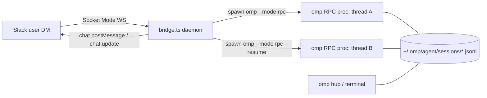

# omp Slack Bridge — Design

Bidirectional Slack ↔ omp integration: dispatch coding tasks from Slack DMs,
interact with running agents (answer `ask` questions, steer), and continue
sessions — modeled on `omp hub` (shared session store, lazy reattach, idle
reaping), but transport is `omp --mode rpc` JSONL over stdio instead of tmux.

## Topology

- One Slack **thread** ↔ one omp **session** (`.jsonl` on disk) ↔ at most one
  live RPC process. Registry persisted at `~/.omp/slack-bridge/state.json`.
- Sessions live in the standard session dir → visible in `omp hub`; terminal
  sessions can be continued from Slack via `resume`, bridge sessions can be
  foregrounded in the hub.
- Idle RPC processes are reaped after `IDLE_TTL_MIN` (hub-style: process dies,
  session file persists); a later thread reply respawns with `--resume`.

## Files (all in `~/.omp/slack-bridge/`)

| File | Owner | Purpose |
|---|---|---|
| `types.ts` | design (done) | All shared contracts. Implementations MUST import from here and MUST NOT redefine. |
| `omp-rpc.ts` | RpcCore | Raw JSONL protocol client over a spawned `omp --mode rpc` process. |
| `slack.ts` | SlackTransport | Socket Mode WS client + minimal Web API wrapper. Zero omp knowledge. |
| `bridge.ts` | BridgeCore | Daemon entry: routing, registry, task lifecycle, ask relay. |
| `blocks.ts` | BridgeCore | Block Kit / mrkdwn rendering helpers. |
| `registry.ts` | BridgeCore | Thread↔session registry with JSON persistence. |
| `omp-rpc.test.ts` | RpcCore | Unit tests against a fake child (`bun test`). |
| `slack.test.ts` | SlackTransport | Unit tests against a local mock WS server (`bun test`). |
| `bridge.test.ts` | BridgeCore | Unit tests for command parsing + registry (`bun test`). |
| `manifest.json`, `.env.example`, `README.md`, `package.json`, `tsconfig.json` | SetupAssets | Slack app manifest, config template, setup + run docs. |

Runtime: **Bun only, zero npm dependencies.** `fetch`, `WebSocket`, `Bun.file`,
`Bun.spawn` cover everything. TypeScript strict.

## omp RPC protocol (pinned; source of truth `~/oh-my-pi-src/docs/rpc.md`)

- Spawn: `$OMP_BIN --mode rpc` (+ `--resume <sessionPath>` to reattach, `-m/--model <spec>` optional), `cwd` = task dir, env `OMP_HUB_NEW_SESSION=1` for *new* tasks (agent self-isolates in a git worktree).
- stdout: one JSON object per line. First relevant frame: `{"type":"ready"}` (wait ≤30s).
- Commands (stdin JSONL, correlate on `id`): `prompt` (with `streamingBehavior:"steer"` — always include; ack is immediate, completion signaled by `agent_end` event), `abort`, `get_state`, `get_last_assistant_text`, `set_session_name`, `set_host_tools`.
- Frames to route: `response` (by `id`); events `agent_start`, `agent_end`, `turn_start/end`, `tool_execution_start/update/end`, `message_update`; `extension_ui_request` (methods `select`, `confirm`, `input`, `editor`, `cancel`, `notify`, `setStatus`, `open_url` — others ignored); `host_tool_call` / `host_tool_cancel`; `extension_error`.
- UI responses (stdin): `{type:"extension_ui_response", id, value:string}` (select → chosen **label**, input/editor → text), `{..., confirmed:boolean}`, `{..., cancelled:true}`.
- **Ask questions**: the builtin `ask` tool does NOT register in RPC mode (`AskTool.createIf` requires interactive UI at tool-registry construction — verified empirically: `get_state.dumpTools` lacks `ask`). The bridge therefore registers its own `ask` **host tool** (`set_host_tools`, schema mirroring the builtin: `questions[]` with `id`/`question`/`options{label,description}`/`multi`/`recommended`). Agent calls → `host_tool_call` → bridge renders Slack blocks per question, collects answers (buttons or free-text thread reply), then sends `host_tool_result` with a text summary (`User answers:` lines). `host_tool_cancel` withdraws pending questions. The `extension_ui_request` select/confirm/input relay stays for extensions and login flows.

## Slack app (Socket Mode — no public URL)

- Tokens: `SLACK_APP_TOKEN` (`xapp-`, scope `connections:write`) + `SLACK_BOT_TOKEN` (`xoxb-`).
- Bot scopes: `chat:write`, `im:history`, `im:write`, `users:read`, `files:write`.
- Events: `message.im`. Interactivity enabled (block actions arrive over the socket as `interactive` envelopes).
- Envelope handling: every envelope MUST be acked (`{envelope_id}`) immediately; payload processing is async after ack. Reconnect on `disconnect` frames / WS close with backoff; dedup retried event deliveries by `event_id`.

## UX (DM with the bot)

Top-level DM commands (first token, case-insensitive). Every reply is a **thread
reply on the triggering message** (`thread_ts` = that message's `ts`, or its
existing root when the command was typed inside a thread), so a task's whole
thread hangs under what the user asked for:

| Command | Behavior |
|---|---|
| `run <alias\|path> <prompt…>` | New task: resolve dir (alias from `REPOS` config, else absolute path under `$HOME`), spawn RPC proc, `set_session_name` from prompt, post the task header as the first reply under the user's message — that message's `ts` is the thread id, register thread. |
| `sessions` | List registry entries (live ⏵ / idle ⏸, dir, name, age) + how to continue (`reply in thread`) . |
| `resume <sessionPath>` | Attach an existing on-disk session (e.g. one started in terminal): spawn `--resume`, post header, register thread. |
| `status` | Bridge status: live procs / registry size / uptime. |
| `help` / anything else top-level | Usage text. Plain top-level text is NOT a task (prevents accidents). |

In-thread messages:

- Pending `input`/`editor` request for that thread → the message text answers it.
- `abort` → RPC `abort`. `kill` → stop proc (session file persists, still resumable). `status` → `get_state` summary.
- Anything else → `prompt` with `streamingBehavior:"steer"` (steers mid-turn, prompts when idle). Proc dead → respawn `--resume` first (lazy reattach).
- Thread the registry doesn't know (a reply under a `sessions` listing or a help message) → handled as a fresh top-level command, so the reply is answered instead of dropped.

Agent → Slack rendering:

- Per turn, one **status message** posted on `agent_start`, then `chat.update`d on a ≥2s throttle: phase line + the last 4 timeline lines. The timeline interleaves thinking excerpts (`💭 …`, one line per thinking block, rewritten in place as it streams) with `tool_execution_start` labels (`⏵ bash`, `⏵ edit src/x.ts`), so a turn that reasons before touching a tool still shows movement. Thinking excerpts come from `message_update` → `assistantMessageEvent` (`thinking_delta`/`thinking_end`); `blocks.ts:thinkingLine` renders the newest complete reasoning-summary headline (gpt-5.x/codex `**Headline**`), else the newest finished sentence, and nothing while the block is still a stub — no token-level streaming (Slack rate limits; deltas add fragility).
- On `agent_end`: fetch `get_last_assistant_text`, replace status message with final text (mrkdwn, 3000-char section chunks; text > 12k chars → `files.uploadV2` snippet attached to thread).
- `extension_ui_request select/confirm` → Block Kit message: question + option descriptions; ≤5 options → buttons, else `static_select`; `action_id` = `ui:<requestId>`, value = option label. Click → `extension_ui_response` + edit the ask message to show the choice (`✅ label — answered by @user`). `cancel` request (`targetId`) → edit ask message to `⌛ cancelled` and drop pending state.
- `notify` → small thread message (info/warn/error prefix). `setStatus`/`open_url` → thread message (URL as link). Everything user-visible passes through `blocks.ts` sanitizers (mrkdwn-escape `&<>`, truncate).

## Security

- Allowlist: ignore every event whose `user` ∉ `SLACK_ALLOWED_USERS` (comma-separated member IDs). No allowlist configured → refuse to start.
- Only `im` channel events processed. `run` paths restricted to `REPOS` aliases + absolute paths under `$HOME`.
- Tokens only in `~/.omp/slack-bridge/.env` (bridge parses it itself at startup; never logged).

## Config (`.env`)

`SLACK_APP_TOKEN`, `SLACK_BOT_TOKEN`, `SLACK_ALLOWED_USERS`,
`OMP_BIN` (default `omp`), `REPOS` (`alias=path,alias=path`),
`DEFAULT_REPO` (alias used when `run` gets no dir), `MAX_TASKS` (default 4),
`IDLE_TTL_MIN` (default 30), `SESSION_NAME_PREFIX` (default `slack:`).

## Lifecycle invariants

1. Registry entry survives proc death and bridge restarts; `sessionPath` is the durable key (hub parity).
2. At most `MAX_TASKS` live procs; `run` beyond that → polite refusal listing live tasks.
3. Reaper tick (60s): proc idle (no turn active, no pending UI request) longer than TTL → SIGTERM, mark idle.
4. Bridge shutdown (SIGINT/SIGTERM): SIGTERM all children, flush registry, close WS.
5. Every pending UI request belongs to exactly one thread; answering twice is a no-op (second click edits message to current state).

## Verification gates (run by orchestrator, not implementers)

1. `bun x tsc --noEmit` clean in `~/.omp/slack-bridge`.
2. `bun test` green (all three test files).
3. Live smoke: `OmpRpc` against real `omp --mode rpc` — prompt "Reply with exactly: OK", observe `agent_end`, `get_last_assistant_text` === "OK"; and an ask relay smoke (prompt instructing an `ask` call, observe `select` request, respond, observe completion).
4. End-to-end Slack test requires user-created app + tokens (manifest provided; user step).
